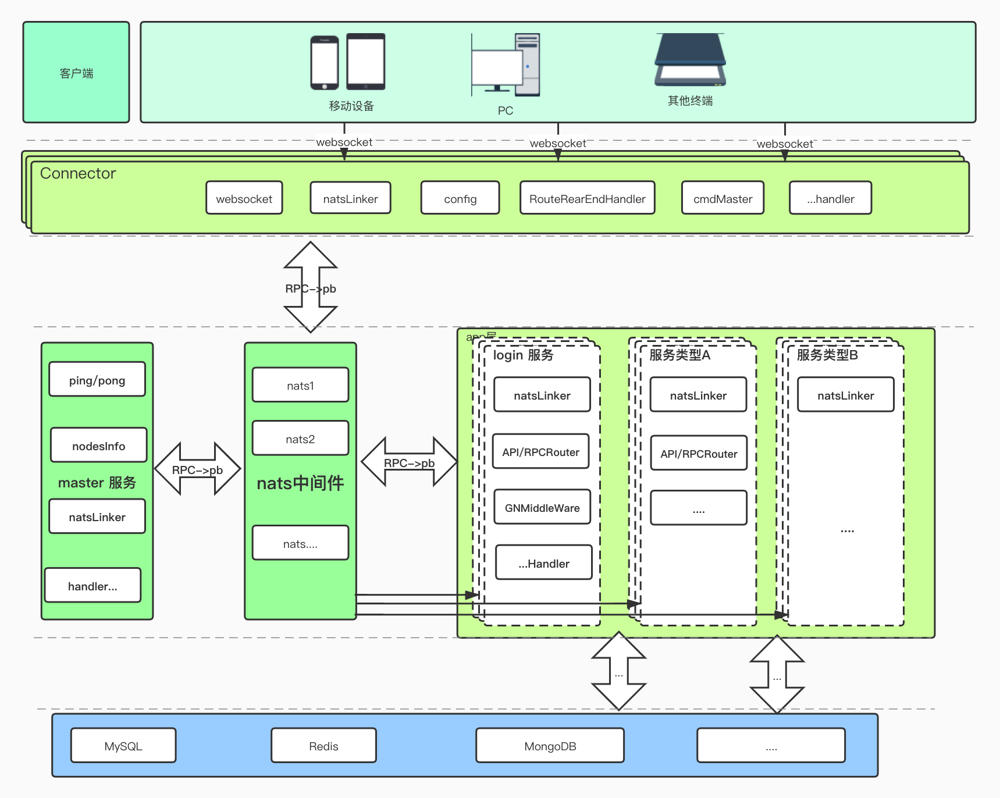

# GN
###### GN是由golang开发的一个 轻量级，上手简单的游戏服务器框架。  <br>
###### GN的RPC调用采用了消息中间件nats，后期可能会扩展纯RPC框架 如GRPC或者gnet等 目前还在酝酿中。<br>
###### GN 的名字正是golang和nats中间件的首字母而来 <br>


--------------

# GN 框架图

--------------

# GN 简介
## 1: handler API 
GN可以根据自己后端API需求，轻松简单实现 该API是 单独协程处理业务逻辑，还是公用一个协程排队处理，如：<br>
```go
APIRouter(router string, newGoRoutine bool, handlerFunc ...HandlerFunc)
RPCRouter(router string, newGoRoutine bool, handlerFunc HandlerFunc)
```
使用样例：
```go
app.APIRouter("addGroup", true, addGroup)
app.APIRouter("createGroup", true, createGroup)
app.RPCRouter("rpcGetAllGroups", false, rpcGetAllGroups)
```

## 2: GN 各个component 组件简介
* `connector组件`：可以理解为 客户端连接服务器的前端网管，主要做消息的路由 以及中转消息包
* `app组件`：GN的主要APP 组件，几乎所有的业务逻辑以及开发接口，都需要此对象
* `master组件`：可以理解为

## 3:GN master 简要说明
#### 目前GN master 模块 并没有 添加 启动以及管理的 子节点的功能，而是简单的添加了  探知各个子节点，
------------
## 4: GN APP 中间件 简要说明
    
------------
# 快速上手 demo
 #### [gnchatdemo](https://github.com/wmyi/gnchatdemo "gnchatdemo")
# API & interface 说明

